# Food Order App - Techcareer iOS Developer Bootcamp Bitirme Projesi 🚀

### Proje Tanımı
Yemek sipariş uygulaması

### Özellikler
* Yemekleri listeleme
* Yemekleri kategorisine göre filtreleme
* Yemek detayı görme
* Detayda adet seçebilme
* Seçilen adet ile yemeği sepete ekleme
* Sepetteki yemekleri görüntüleme
* Sepetten yemek silme

### Kullanılan Kütüphaneler
* Alamofire
* Kingfisher

### Kullanılan Servisler
* Tüm yemekleri alma http://kasimadalan.pe.hu/yemekler/tumYemekleriGetir.php
* Sepetteki yemekleri alma http://kasimadalan.pe.hu/yemekler/sepettekiYemekleriGetir.php
* Sepete yemek ekleme http://kasimadalan.pe.hu/yemekler/sepeteYemekEkle.php
* Sepetten yemek silme http://kasimadalan.pe.hu/yemekler/sepettenYemekSil.php
* Yemek resimlerini alma http://kasimadalan.pe.hu/yemekler/resimler/ayran.png

### Dark UI Screenshots
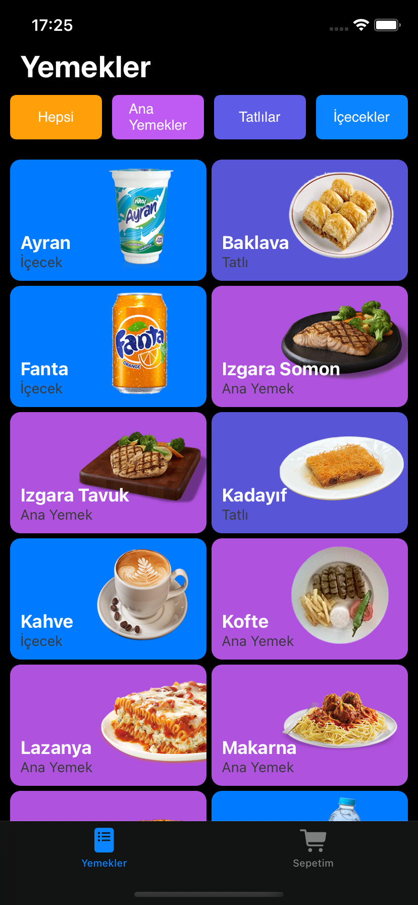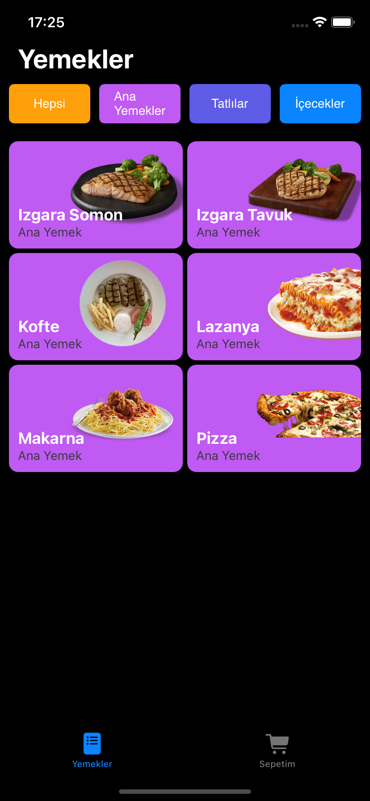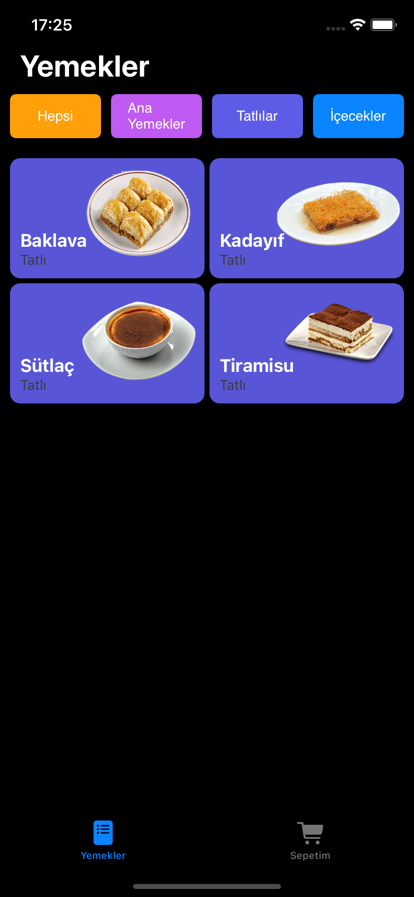 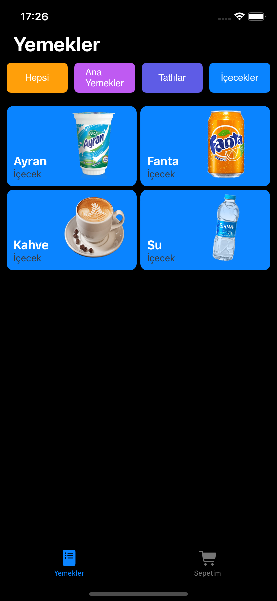 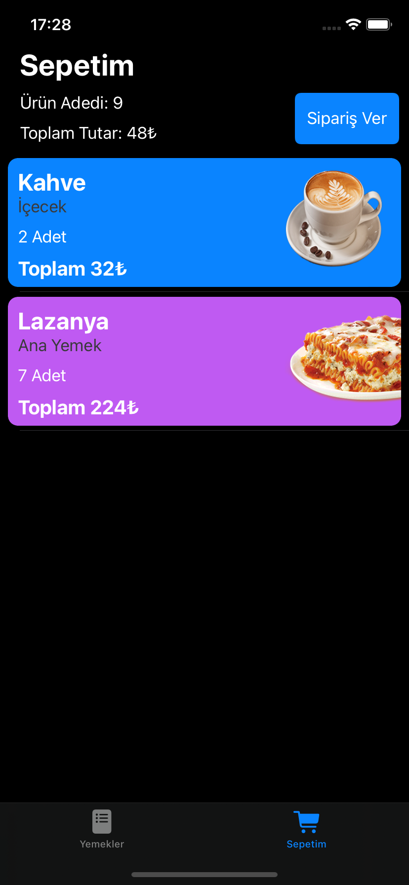 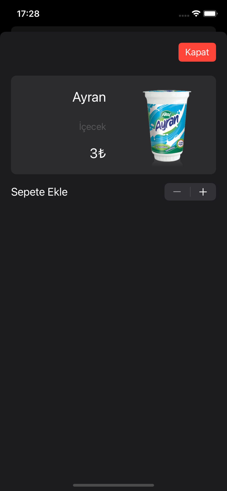 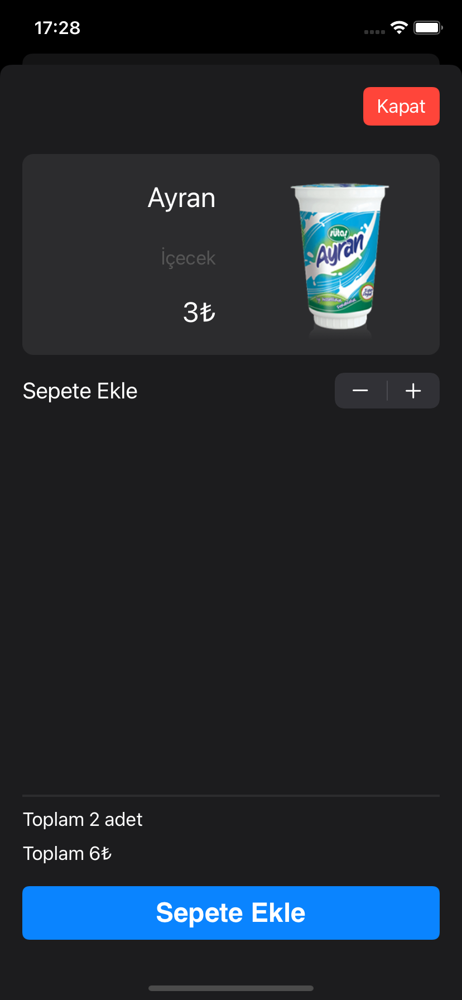 

### Light UI Screenshots
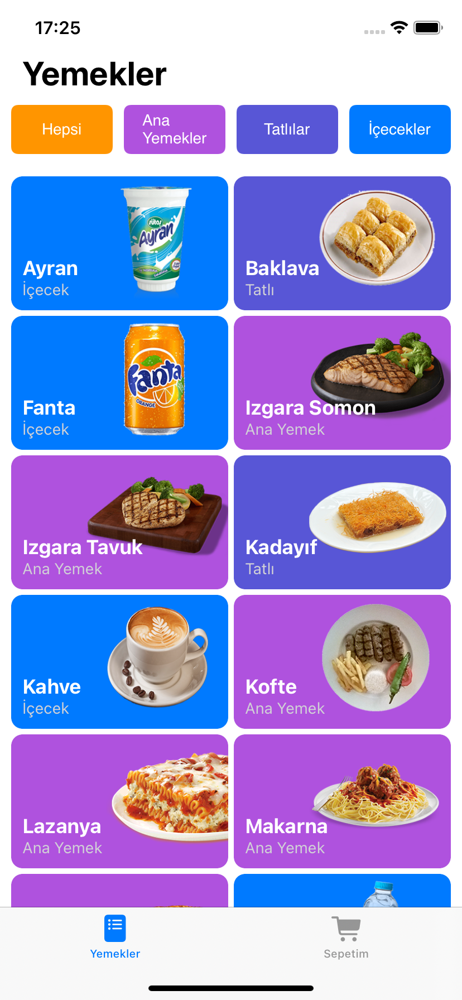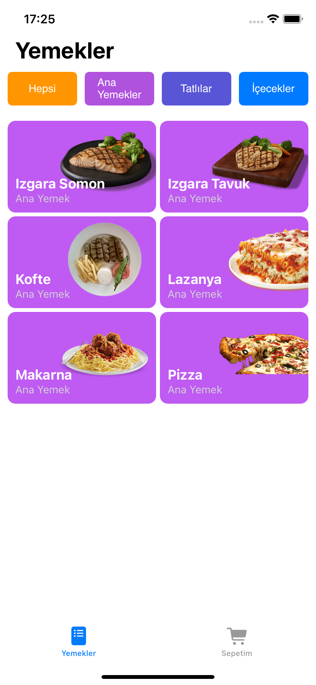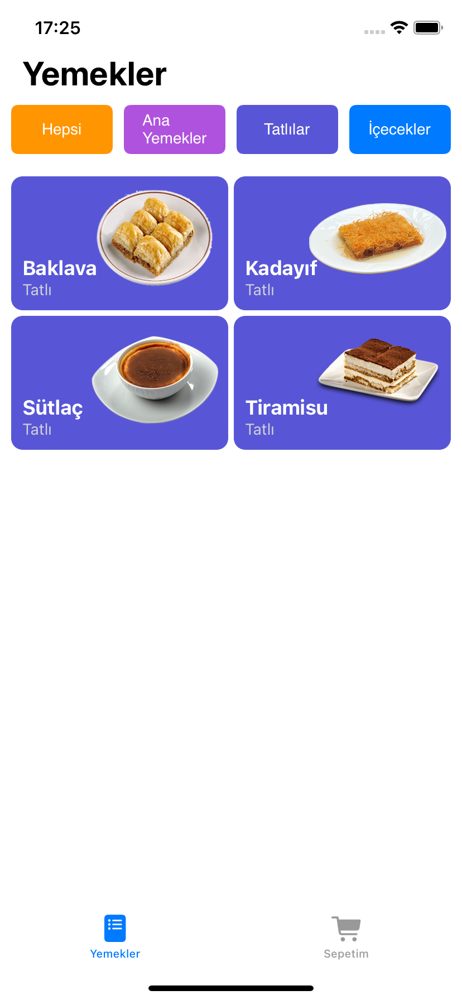 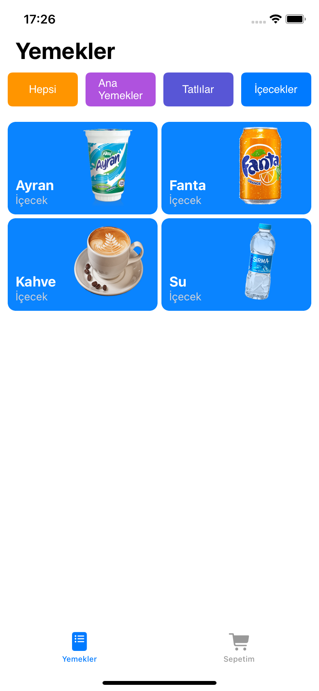  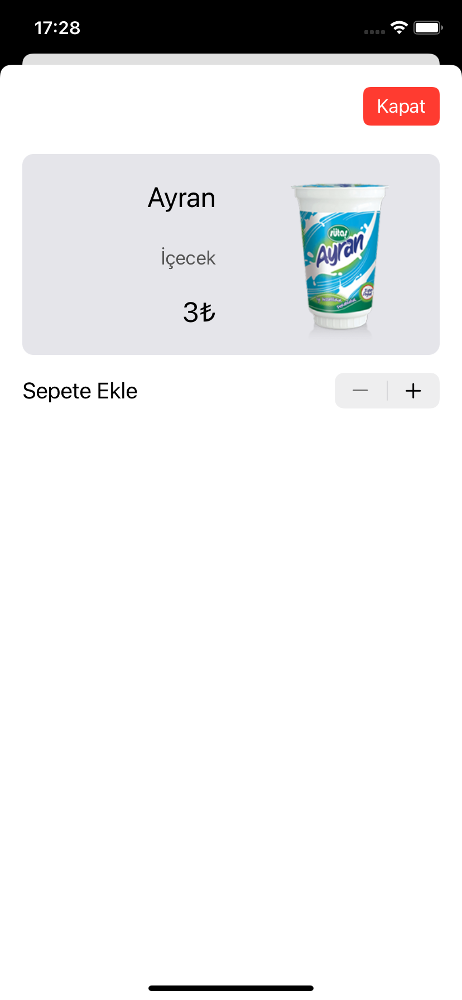 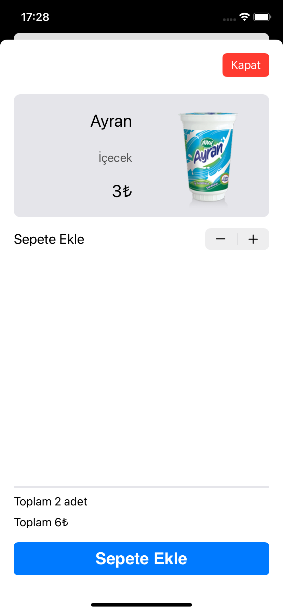
